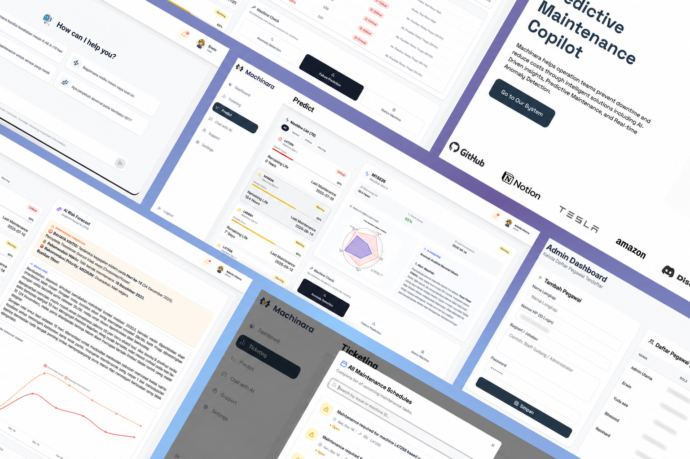
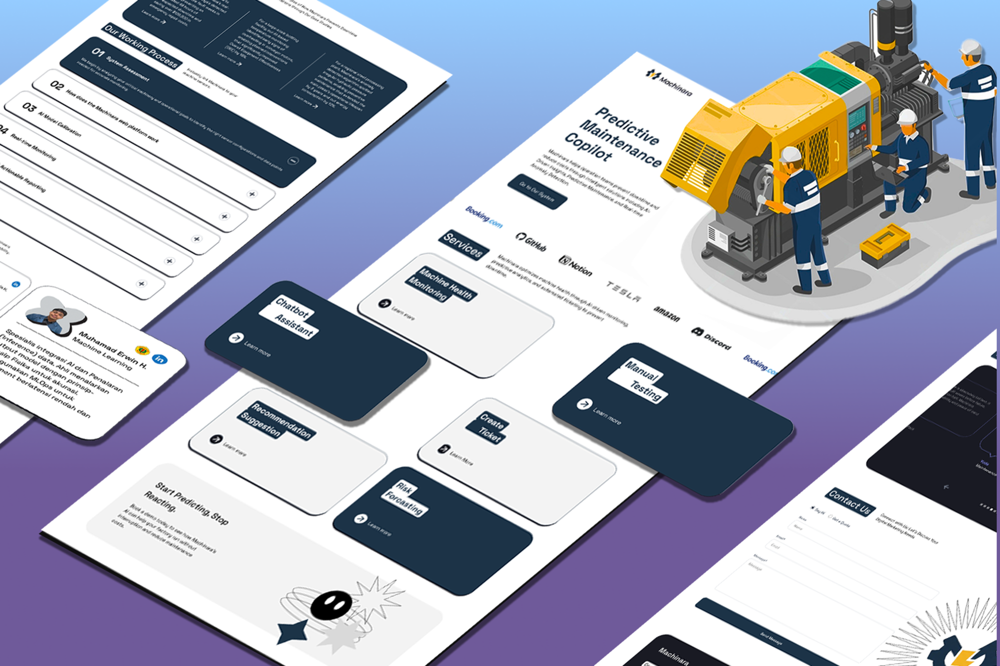
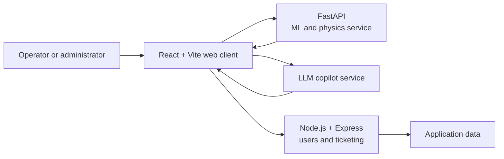

# Machinara — Predictive Maintenance Copilot

> An AI-assisted maintenance prototype for exploring machine health, testing operating scenarios, forecasting failure risk, and prioritizing maintenance work.

  

[**Open the Machinara deployment**](https://machinara.wintech.my.id/)

## Overview

Machinara is a five-person ASAH by Dicoding capstone exploring how machine-learning predictions, physics-based operating rules, and a conversational assistant can support industrial-maintenance decisions.

The prototype brings anomaly detection, failure forecasting, what-if simulation, AI-assisted interpretation, and maintenance-ticket prioritization into one web experience. It uses the AI4I sample dataset together with manual and simulated operating inputs rather than a live industrial sensor feed.

## Product Showcase

  

  

## My Contribution

**Machine Learning and AI Integration — Muhamad Erwin Hariadinata**

- Implemented and refined FastAPI forecasting and duty-cycle simulation.
- Normalized natural-language scenarios into structured machine parameters.
- Integrated risk output with automatic maintenance-ticket priority rules.
- Hardened configuration by moving the LLM service credential to environment-based configuration.
- Integrated service URLs in the portfolio deployment.

Machinara was developed collaboratively. This showcase describes my contribution without implying sole authorship of the complete platform.

## Core Capabilities

### Hybrid anomaly detection

- Random Forest, XGBoost, and One-Class SVM models identify abnormal behavior and degradation patterns.
- Physics-based guardrails check operating values against machine limits.
- Power, overstrain, wear, and heat-related rules provide additional safety signals.
- A critical physical condition can override an optimistic statistical prediction.

### Failure forecasting and what-if simulation

- Users can test proposed RPM, operating duration, and material scenarios.
- Natural-language scenarios are converted into structured simulation variables.
- Baseline and simulated trends expose potential critical thresholds.
- Forecast context can be carried into a maintenance request.

### Context-aware maintenance copilot

- Interprets machine-specific health and forecast context.
- Normalizes natural-language operating scenarios into system parameters.
- Explains indicators and suggests maintenance actions.
- Maintains conversation context for the selected machine session.

### Priority-based ticketing

- Converts elevated risk into actionable maintenance work.
- Prioritizes tickets using predicted time-to-failure windows.
- Supports both user-requested and system-suggested ticket creation.

### Administration and access control

- Employee account and role management
- Administrator and operational-user access
- Personnel profile and job-title management
- Controlled access to monitoring, prediction, chat, and ticketing features

## System Architecture

## Technology Stack

| Layer | Technology |
| --- | --- |
| Web client | React 19, Vite 7, React Router |
| Styling and UI | Tailwind CSS 4, Radix UI primitives |
| Visualization | Chart.js, Recharts, React Chart.js 2 |
| ML and physics service | Python, FastAPI, Uvicorn, scikit-learn |
| Application service | Node.js, Express |
| AI integration | LLM-based natural-language analysis |
| Delivery | REST APIs, custom web deployment |

## Live Demo

[Open the Machinara application](https://machinara.wintech.my.id/)

Demo accounts documented for the project environment:

| Username (phone number) | Password | Role |
| --- | --- | --- |
| `081234567890` | `123` | Administrator |
| `089876543210` | `123` | User |

These accounts are for portfolio demonstration only. Feature availability depends on the deployed application services.

## Repository Contents and Source Availability

This public showcase contains curated portfolio documentation and privacy-reviewed presentation assets. The product and service repositories remain private because they include team-owned implementation context and deployment configuration. A technical walkthrough or source review can be provided upon request.

## Team Attribution

Machinara was created collaboratively as an ASAH by Dicoding capstone. The complete product represents team work; this showcase focuses on Muhamad Erwin Hariadinata's verified machine-learning, forecasting, LLM, API-integration, and ticket-priority contributions.

## Project Scope

Machinara is an educational capstone and portfolio project using sample data and manual/scenario inputs. It is not a real-time industrial IoT deployment and is not certified for safety-critical use. Production adoption would require independently validated models, calibrated machine limits, secure sensor ingestion, hardened identity and data services, observability, and formal security and safety reviews.

## Portfolio Owner

**Muhamad Erwin Hariadinata**

[GitHub](https://github.com/antiffraud) · [LinkedIn](https://www.linkedin.com/in/muhamad-erwin-hariadinata/)
